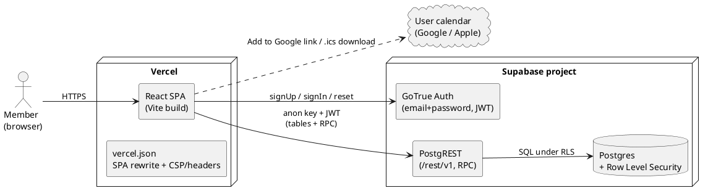
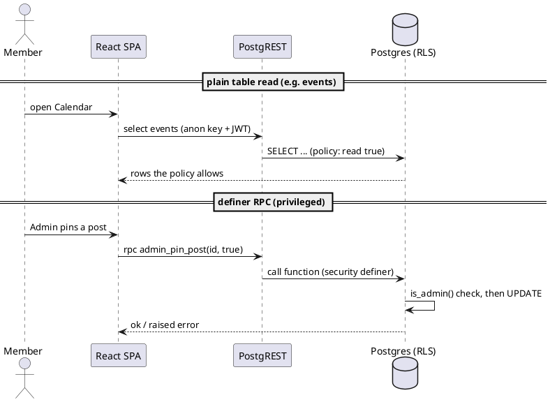
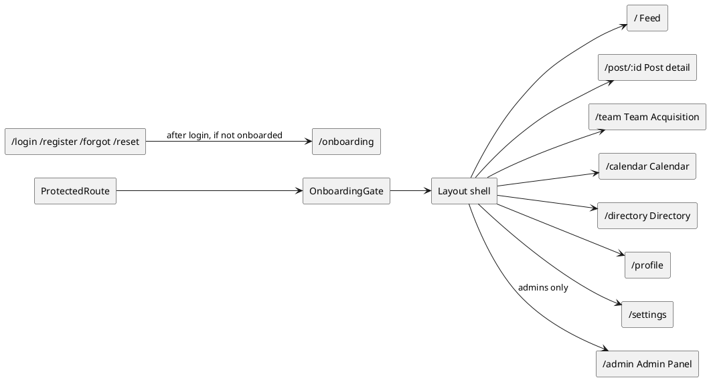
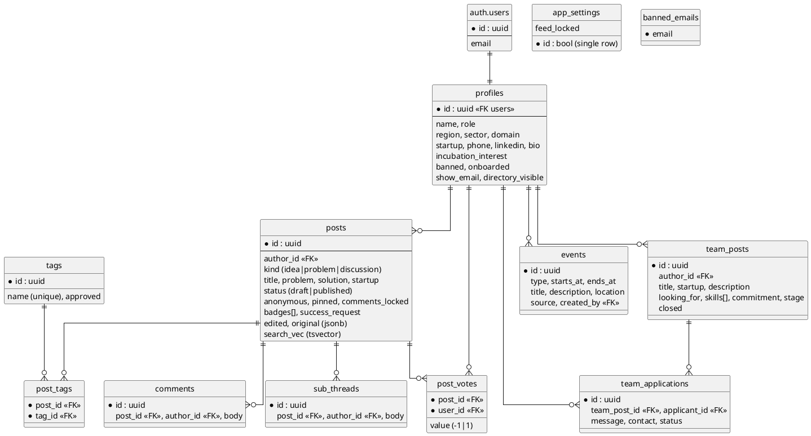
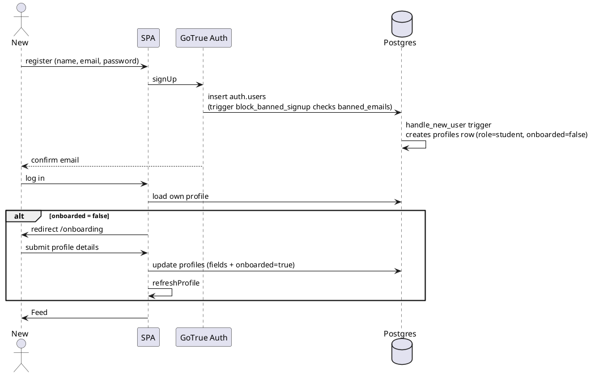
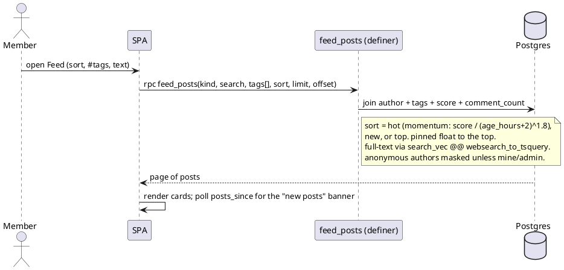

# IFN Architecture (living design)

> Single design doc for what we are building now. The deep pre-build reference material
> (PRD, data model, ADRs, sequence flows) lives in `reference/`. Day-to-day state and the
> next-steps list live in `PROGRESS.md`. Live database schema + apply order live in `db/README.md`.

## What IFN is
ICFAI Founders Network: a tech-incubator network for ICFAI students. Members share startup
ideas and problems, vote and comment, find teammates, browse a member directory, follow a
shared events calendar, and (planned) move ideas through a gated mentorship pipeline (G1 to G6).
Product spec: `reference/IFN PRD.md`.

## Locked stack (2026-06-10)
- Frontend: Vite + React SPA, hosted on Vercel.
- Backend + Database: Supabase (Auth + Postgres + Row Level Security). No separate Express server.
  The SPA talks straight to Supabase via `@supabase/supabase-js`.
- Auth: Supabase Auth (managed), email + password. Session is the Supabase default for a Vite SPA:
  a JWT in localStorage (not a server httpOnly cookie; that would need a server runtime).
- Why no backend tier: removes CORS, cross-site cookies, and a whole deploy surface. RLS is the
  data guard. A server tier can be added later for the gate/pipeline state machine if needed.

### System context



## Security model
- anon key: public, ships in the frontend. Safe only because RLS guards every row.
- service_role key: secret, bypasses RLS. Server-only; this stack never ships it (not in frontend,
  not in git).
- RLS: enabled on every table, default-deny, with explicit policies keyed to `auth.uid()` and role.
- Privileged writes go through `security definer` RPCs that re-check authorization inside the
  function (`is_admin()`, ownership), so the client never needs elevated table grants. Sensitive
  columns are revoked from the `authenticated` role (pinned, badges, success_request, comments_locked,
  banned, role, kind, created_at) so they can only change via the definer RPCs.
- Anonymous posting: the author id is stored, but the masking RPCs (`feed_posts`, `post_detail`,
  `post_subthreads`) return null author for anonymous posts unless the viewer is the author or an admin.

### How a request is authorized



## Frontend shape
- Routing: React Router. Public routes (login, register, forgot/reset password) are wrapped in
  `PublicOnlyRoute`. The app shell is wrapped in `ProtectedRoute` (requires a session, shows a
  banned wall) then `OnboardingGate` (first-time users are sent to `/onboarding`).
- Shell: `Layout` = `Topbar` (logo, notification bell of nearby events, profile menu) + `SideNav`
  (left rail) + page `Outlet` + `RightSidebar` (feed only: trending tags, upcoming events).
- State: `AuthProvider` holds the session and the caller's own profile row, and derives
  `isAdmin`, `banned`, `onboarded`, plus `refreshProfile()`.

### Routes and modules



## Data model
Profiles is 1:1 with `auth.users`. Everything else hangs off profiles and posts. Full column
detail and apply order: `db/README.md`. ER overview:



## Key flows

### Register, onboard, enter the app



### Feed read (ranking, search, masking)



## Built modules (2026-06-10)
- Auth: register, login, forgot/reset password, session, route guards. Audit: `auth-architecture.md`.
- Onboarding: first-time profile setup gate (`/onboarding`).
- Feed: kinds idea/problem/discussion, momentum/new/top sort, FTS + multi-supertag filter, votes,
  drafts (in the create modal), edit post, infinite scroll, new-posts banner, error+retry.
- Post detail: votes, creator updates (sub-threads), comments, edit/delete, admin pin + comment lock.
- Team Acquisition: post role needs, apply with message + contact, withdraw, applicants view,
  open/closed lifecycle, owner edit, admin delete.
- Calendar: month grid, admin event CRUD, add-to-Google + .ics export, sidebar + bell surfacing.
- Directory: search + filter by role/region/sector/domain, opt-in email, no phone.
- Admin Panel: member roles, ban/unban, edit any profile, #Success approval queue, feed lock,
  per-post comment lock, searchable members.

## Reference (pre-build design)
`reference/` holds the original design set (PRD, Data Model, ADRs, Authorization Matrix, Sequence
Flows, Security & Threats, Runbook, Backup & Restore, v1 Scope, Workflows, Index). That set assumed
an Express + Postgres backend with passwordless magic-link auth. This build pivoted to Supabase Auth
+ password (see the decision log). Treat `reference/` as design input, not current truth where it
conflicts with this file.

## Decision log
- 2026-06-10: Auth method magic-link to password (user choice), built on Supabase Auth.
- 2026-06-10: Provider Supabase Auth (managed) over hand-rolled.
- 2026-06-10: Topology Vercel SPA to Supabase direct, no Express. Session = localStorage JWT.
- 2026-06-10: httpOnly cookie requirement relaxed for this stack (would need Next.js SSR).
- 2026-06-10: Removed the @ifheindia.org email restriction (can re-add server-side later).
- 2026-06-10: Tags auto-approve; only #Success needs admin approval. Moderation lives in admin RPCs.
- 2026-06-10: Calendar integration via per-event export (Google link + .ics), no OAuth sync.
- 2026-06-10: Ban is app-level (profiles.banned + banned_emails + write guards + logout wall);
  a hard auth-level ban would need the service_role key on a server, which we do not ship.
```
