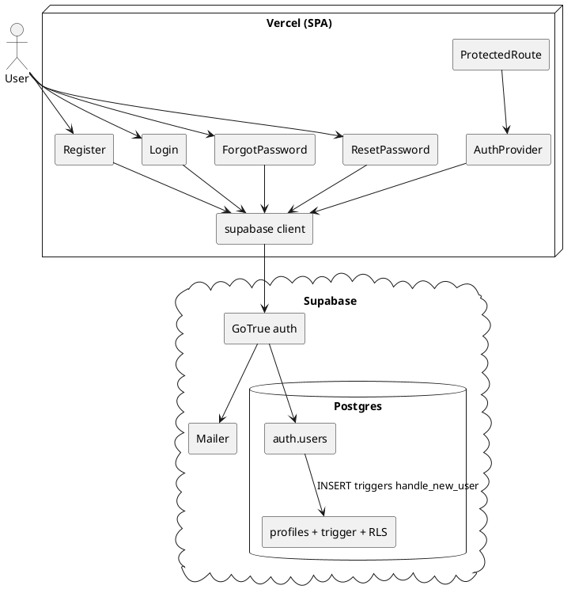
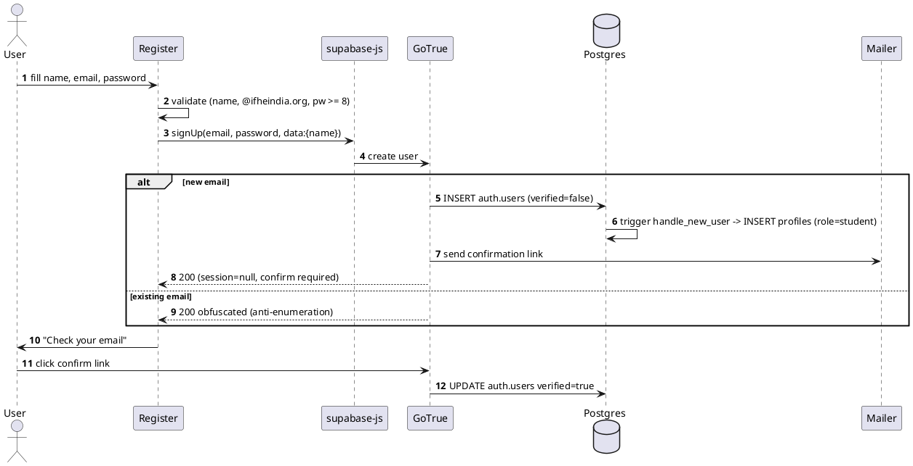
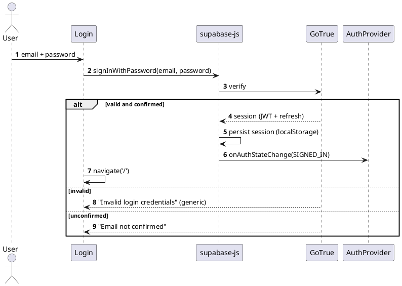
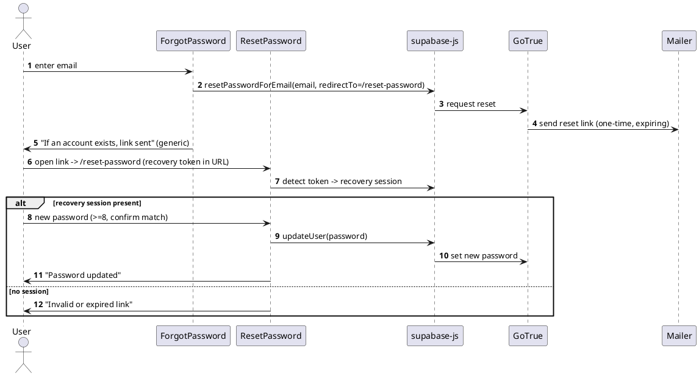
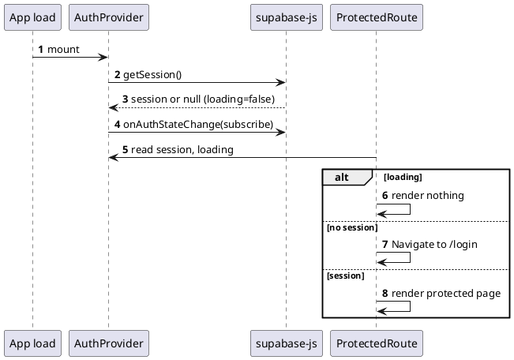

# IFN Auth: Architecture and Audit

Scope: the authentication module of the IFN web app (Vite SPA on Vercel, Supabase Auth + Postgres).
Covers register, login, forgot/reset password, session, and route guarding. Audited for security,
validation, duplicate handling, and edge cases on 2026-06-10.

Related: `architecture.md` (overall design), `PROGRESS.md` (build state).

## 1. Components

| Layer | Piece | Role |
|-------|-------|------|
| Client | `lib/supabase.js` | single supabase-js client (URL + anon key) |
| Client | `lib/AuthProvider.jsx` | session context via `getSession` + `onAuthStateChange` |
| Client | `components/ProtectedRoute.jsx` | redirect to `/login` when no session |
| Client | `pages/Register.jsx` | `signUp` (name in metadata) |
| Client | `pages/Login.jsx` | `signInWithPassword` then redirect |
| Client | `pages/ForgotPassword.jsx` | `resetPasswordForEmail` |
| Client | `pages/ResetPassword.jsx` | `updateUser({password})` in recovery session |
| Backend | Supabase Auth (GoTrue) | hashing (bcrypt), tokens, emails, sessions |
| Backend | `auth.users` | identity + `encrypted_password` (managed) |
| Backend | `public.profiles` + `handle_new_user` trigger | app profile, created on signup |
| Backend | RLS on `profiles` | read/update own; role column update revoked |

Session model: a JWT held in **localStorage** (Supabase default for a plain SPA), not an httpOnly
cookie. This removes CSRF risk but accepts XSS token-theft risk. See finding S1.

## 2. Component view

## 3. Workflows

### 3.1 Register and verify

### 3.2 Login

### 3.3 Forgot and reset password

### 3.4 Session and guard

## 4. Findings

Severity: Critical, High, Medium, Low. Status: Open or Handled.

### Security
| ID | Finding | Severity | Status | Fix |
|----|---------|----------|--------|-----|
| S1 | Session JWT in localStorage; readable by JS, so XSS can steal it | Medium | Mitigated | Strict CSP added via vercel.json (script-src 'self', no inline/eval) plus nosniff, frame-deny, referrer headers. Residual risk: move to httpOnly cookies (Next.js SSR) if it grows |
| S2 | Email domain restriction | High | Handled | Enforced server-side: `enforce_registration_policy` BEFORE-INSERT trigger on `auth.users` (db/invites.sql) rejects signups that are not `@ifheindia.org` unless the email has a live invite. Role is granted only on email confirm and is never read from the client. Mentors/admins are onboarded via admin invite links (Admin Panel -> Invites; optional Resend auto-email via the `send-invites` Edge Function). The Register.jsx check is UX-only. Coexists with `block_banned_signup` |
| S3 | Logged-in session can change password with no re-auth (`updateUser({password})`); a hijacked session can lock the user out | Medium | Open | Require recent re-authentication for password change; keep JWT expiry short |
| S4 | Password min length mismatch: client requires 8, Supabase server default is lower, so a direct API call can set a weaker password | Medium | Open | Set Supabase Auth min password length to 8 (and consider complexity) |
| S5 | Role self-escalation via profile update or signup metadata | High | Handled | RLS revokes update on `role`; trigger sets role by DB default and never reads role from metadata |
| S6 | Account enumeration on register/login/forgot | Medium | Handled | Supabase obfuscates existing-email signup; login returns generic error; forgot shows generic message |
| S7 | Anon key shipped in frontend | Info | Handled | Public by design; safe because RLS guards rows. Keep RLS on every table |
| S8 | Rate limiting / email flooding | Medium | Deferred | Not addressing now (planning to move off Supabase). Full detail and plan in section 7 |
| S9 | CSRF | Info | N/A | Token in localStorage (Authorization header), not a cookie, so CSRF does not apply |

### Validation
| ID | Finding | Severity | Status | Fix |
|----|---------|----------|--------|-----|
| V1 | Email validation | Low | Fixed | Domain check removed; now trims and validates a basic email shape before submit |
| V2 | No confirm-password on register (only on reset), so a typo locks the user out until reset | Low | Open | Add a confirm-password field to register |
| V3 | Password has a client min only; no max note (bcrypt truncates at 72 bytes, handled by Supabase) | Low | Info | Document; rely on Supabase |
| V4 | Name accepts any non-empty trimmed string (no length cap) | Low | Open | Cap length, basic sanitisation |

### Duplicate handling
| ID | Finding | Severity | Status | Fix |
|----|---------|----------|--------|-----|
| D1 | Duplicate registration (same email) | Low | Handled | `auth.users.email` is unique; existing email returns an obfuscated response; no second profile |
| D2 | One profile per user | Low | Handled | `profiles.id` is the PK and FK to `auth.users`; trigger inserts exactly one row |
| D3 | Double-click submit creates duplicate requests | Low | Handled | Submit button disabled while `loading` |

### Edge cases
| ID | Finding | Severity | Status | Fix |
|----|---------|----------|--------|-----|
| E1 | Network error froze the form (no try/catch) | Medium | Fixed | All four auth calls wrapped in try/catch/finally; loading always resets and a generic error shows |
| E2 | Login before email confirmation | Low | Handled | Supabase returns "Email not confirmed"; shown to the user |
| E3 | `/reset-password` opened without a recovery session (direct nav or expired link) | Low | Handled | Guard shows "Invalid or expired link" |
| E4 | Logged-in user on public auth routes | Low | Fixed | PublicOnlyRoute redirects authed users to `/` (login, register, forgot) |
| E5 | Redirect race: `navigate('/')` right after login before the context updates could momentarily bounce to `/login` | Low | Watch | In practice the SDK sets the session before resolving; consider redirecting via an effect on session change |
| E6 | Logout is local scope; sessions on other devices persist | Low | Info | Use global sign-out scope if full revoke is desired |

## 5. Prioritised fixes
1. ~~**S2 (High)** server-side `@ifheindia.org` enforcement (auth hook or trigger).~~ **Done** — `enforce_registration_policy` trigger + invites (db/invites.sql). See S2.
2. **E1 (Medium)** try/catch/finally around every auth call, so a dropped network does not freeze the form.
3. **S4 (Medium)** set the Supabase password min length to 8 to match the client.
4. **S3 (Medium)** require re-auth for password change.
5. **S1 (Medium)** add a Content Security Policy to reduce XSS token-theft surface.
6. Low items: V1 email validation, V2 confirm-password, E4 public-only guard, S8 rate-limit review.

## 6. What is already solid
Email confirmation required, generic anti-enumeration responses, role escalation blocked at the DB,
one-profile-per-user, double-submit prevented, reset link guarded, password hashing handled by
Supabase (bcrypt), and the guard waits on the initial session check so there is no auth flash.

## 7. Rate limiting (S8): detail and plan

**Status: deferred.** Not addressing this now, because the plan is to move off Supabase. Revisit when
the new backend lands. This section is the record so it is not lost.

### The risk
The auth endpoints do work and send outbound email for any submitted address, so without limits:
- **forgot-password** and **register** can be hit repeatedly to email-bomb a victim or burn the email quota.
- **login** can be brute-forced.
- **token verification** can be guessed at volume.

### Fix while on Supabase (no app code, dashboard only)
Supabase enforces auth rate limits server-side. Tighten them in Dashboard, Authentication, Rate Limits:
- sign-ups per hour (per IP)
- **emails sent per hour** (the main email-bomb control)
- OTP / magic-link requests
- token verifications and token refresh

Lowering the email-send and sign-up caps is the high-value change for a campus-scale app.

### Fix after moving off Supabase (own backend, the real plan)
Once auth runs on your own backend, rate limiting is your responsibility:
- Add a middleware limiter (for example `express-rate-limit`) on `login`, `register`, `forgot-password`, `reset`.
- **Per-IP limits plus a per-email cooldown** (for example one reset email per 60s, capped per hour).
- Use a **shared store (Redis)** once you run more than one instance, so the limits hold across instances.
- Cap outbound email at the mailer layer (a hard ceiling per address per window).

This matches reference ADR-019 (rate limiting) in `reference/`.

### Why deferred
No production traffic yet, and the auth layer is changing providers. Setting Supabase limits now would
be throwaway work. Carry this as a launch-checklist item for the new backend.

