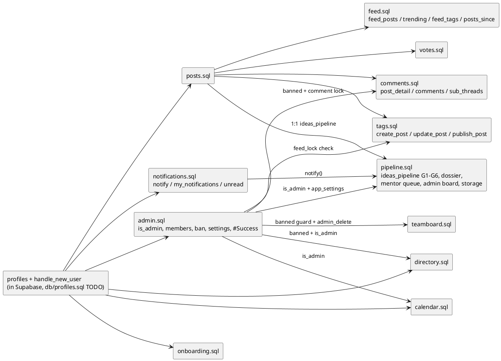

# IFN Database Architecture (Supabase)

Live schema for the current build. Postgres on Supabase, with Supabase Auth (GoTrue) and Row
Level Security. The Vite SPA talks to the database directly with the anon key; RLS is what keeps
data safe. SQL files in this folder are the version-controlled record (applied by hand in the
Supabase SQL editor for now).

Reference design (older, Express + magic-link) lives in `../reference/IFN Backend — Data Model.md`.
Where it conflicts with this file, this file is current. ER overview lives in `../architecture.md`.

## Apply order
Run in the Supabase SQL editor in this order (later files depend on earlier ones, mainly on
`profiles` and `is_admin()`). All files are idempotent and safe to re-run.

Note: when a file changes a function's return type or argument list (for example `feed_posts`
gaining `comment_count` or `p_tags text[]`), it drops the old signature first, so re-running it
is the fix for a `PGRST202`/"function not found" error after a deploy.

## Security model (applies to every table)
- **anon key** is public (shipped in the frontend); safe only because RLS guards every row.
- **service_role key** bypasses RLS; server-only, never shipped to the client.
- **RLS on every table**, default-deny, with explicit policies.
- Triggers that write on a user's behalf use `security definer` + `set search_path = public`.
- Privilege columns (role, pinned, badges, success_request) are revoked from `authenticated` so
  users cannot self-escalate or self-award. Never read role from `user_metadata`.

## Tables

### auth.users (managed by Supabase)
Identity: `id`, `email`, `encrypted_password` (bcrypt), confirmation state. Not directly editable.

### public.profiles
1:1 with `auth.users` (same `id`). Created by a trigger on signup.
- Columns: `id` (PK, FK auth.users, cascade), `name`, `role` (default `student`, check
  student|mentor|admin), `region`, `sector`, `domain`, `incubation_interest` (bool),
  `linkedin`, `phone`, `bio`, `startup`, `created_at`. Added by later files:
  `banned` (admin.sql), `show_email` + `directory_visible` (directory.sql), `onboarded` (onboarding.sql).
- Trigger `handle_new_user` (security definer): inserts the profiles row from signup metadata.
  `block_banned_signup` (admin.sql) trigger rejects signups whose email is in `banned_emails`.
- RLS: read own, update own. Revoke update on `role`, `id`, `created_at`, `banned` so they cannot
  be self-changed (admins set role/banned via definer RPCs). `show_email`, `directory_visible`,
  `onboarded` are user-settable on their own row.
- Note: the base table + `handle_new_user` are not yet captured as a SQL file here (see TODO);
  the column additions and triggers above are in their respective files.

### public.posts  (db/posts.sql)
Unified feed (ideas, problems, discussions).
- Columns: `id`, `author_id` (FK profiles, cascade), `kind` (idea|problem|discussion), `anonymous`,
  `startup`, `title`, `problem`, `solution`, `status` (draft|published), `pinned`, `comments_locked`,
  `badges[]`, `success_request` (none|pending|approved|rejected), `edited`, `edited_at`,
  `original` jsonb, `search_vec` tsvector (generated, GIN indexed), `created_at`.
  Indexed on (kind,status,created_at), author, pinned.
- RLS: read published or own drafts; insert/update/delete own.
- Revokes: insert (pinned, comments_locked, badges, success_request); update (pinned,
  comments_locked, badges, success_request, author_id, kind, created_at).

## TODO (database work)
- [ ] Backfill `db/profiles.sql` (profiles table + `handle_new_user` trigger + RLS) so it is tracked, not just in Supabase.
- [ ] `feed_posts` RPC (security definer): join author name/role and mask anonymous authors (admins see real identity). Keeps profiles RLS strict.
- [ ] `post_votes` (per-user -1/1, composite PK, score = sum) + RLS (one vote per user per post).
- [x] `comments` + `sub_threads` + RLS + post_detail/post_comments/post_subthreads RPCs (db/comments.sql). Comments by anyone; sub_threads (updates) only by the post author; delete own; post delete cascades.
- [x] `post_votes` + RLS (db/votes.sql); feed_posts returns score + viewer vote; trending_tags RPC.
- [x] `tags` + `post_tags` + `tag_requests` + RLS + `create_post` + `update_post` RPCs (db/tags.sql). New tags auto-approved for now (moderation moves to the admin layer). Drafts = posts.status='draft'. `update_post` edits own post (snapshots first version into posts.original, marks edited, resets tags). Admin approval queue + #Success still TODO.
- [x] `feed_posts` RPC (db/feed.sql): full-text search (`p_search`) + multi-supertag AND filter (`p_tags text[]`) + sorts hot/new/top + comment_count + score + viewer vote; masks anonymous authors. `feed_tags`, `trending_tags`, `posts_since` helpers.
- [x] `notifications` (db/notifications.sql, ADR-020): RLS read/mark-read/delete own; `notify()` (definer, internal-only) + `my_notifications` / `notifications_unread_count` / `mark_notifications_read`. Written inline by pipeline RPCs.
- [x] Idea Pipeline (db/pipeline.sql, design in ../pipeline-architecture.md): `pipeline_ideas` is a STANDALONE application (title/oneliner/problem/solution/startup, IFN-n via advisory lock, gates G1-G6, states active|refine|rejected) - fully decoupled from posts/feed. Children keyed by idea_id: `gate_transitions` (audit) + `idea_submissions` (per-gate jsonb templates, revisions kept) + `idea_reviews` (7-criteria rubric) + `idea_actions` (off-app tasks) + `idea_messages` (private thread) + `attachments`. All default-deny; RPCs: pipeline_submit/update_pipeline_idea/submit_gate/resubmit_idea/idea_dossier/my_pipeline (student), mentor_queue/mentor_pick/mentor_accept/my_mentees/review_gate/action_create (mentor), admin_pipeline_board/counts/assign_mentor/bulk_assign/move_gate/reject_idea/delete_pipeline_idea/mentor_load/set_pipeline_locked (admin). Storage bucket `idea-files` (private, 20MB, doc/pdf/ppt) + policies. pg_cron stale nudge (enable pg_cron extension in Dashboard -> Database -> Extensions; the file no-ops without it).
- [ ] `reports` table (moderation) + RLS; admin resolve/hide.
- [x] Admin layer (db/admin.sql): `is_admin()` definer helper; all admin ops via guarded RPCs (no extra RLS): `admin_members` (joins auth.users for email), `admin_set_role` (student/mentor/admin, never own), `admin_pin_post`, `admin_delete_post`, `admin_delete_comment`; #Success flow: `request_success` (author) -> `admin_success_queue` -> `admin_review_success` (approve adds 'Success' to posts.badges). 'success' is a reserved tag name. Bootstrap admin = college email (update profiles via auth.users lookup).
- [x] Admin settings (db/admin.sql): `app_settings` single-row table (`feed_locked`) + `admin_set_feed_locked` (create_post rejects non-admins when locked); per-post `posts.comments_locked` (revoked from authenticated) + `admin_set_comments_locked`; comments insert RLS blocks when the post is locked; post_detail returns comments_locked.
- [x] Admin member management (db/admin.sql): `admin_get_profile` + `admin_update_profile` (edit any member's profile); ban = `profiles.banned` (revoked from authenticated) + `banned_emails` table + `block_banned_signup` trigger on auth.users (blocks re-registration); `admin_ban_user`/`admin_unban_user` (cannot self-ban); banned blocks writes (create_post, comments insert RLS, team_apply, team_posts insert) + a logout wall in ProtectedRoute. admin_members returns banned.
- [x] Onboarding (db/onboarding.sql): `profiles.onboarded` (default false; trigger leaves it false for new signups) + safe one-time backfill (rows with existing data -> true). Frontend: OnboardingGate wraps the app shell and redirects users with onboarded=false to /onboarding (a full-page form: name/region/sector/domain required, startup/phone/linkedin/bio/incubation optional) which sets the fields + onboarded=true, then AuthProvider.refreshProfile() and into the app.
- [x] Directory / Network (db/directory.sql, FRD Module K): `directory(...)` security-definer RPC. Phone is NEVER exposed; email only when `show_email`; members hidden unless `directory_visible` (default true); banned hidden; ILIKE name/startup. Both prefs (`show_email`, `directory_visible`) toggled in Settings (not Profile). Cards show LinkedIn + opt-in email only.
- [x] Calendar & Events (db/calendar.sql, FRD Module I): `events` table (type Workshop/Mentorship/Deadline/Hackathon/Other, starts_at/ends_at, `source` for future pipeline-populated events) + RLS read-all; admin RPCs `admin_create_event`/`admin_update_event`/`admin_delete_event`. Frontend: month-grid Calendar page, per-event Add-to-Google link + .ics download (Option 1, no OAuth), Upcoming Events in the feed right sidebar, nearby events (next 7 days) in the notification bell. Pipeline-populated events deferred until the pipeline exists.
- [x] Team Acquisition (db/teamboard.sql): `team_posts` + `team_applications` (unique per person) + RLS; `team_feed` (author + app_count + i_applied + is_mine), `team_apply` (no own-post/dup, message required), `team_applicants` (post author/admin only; profile + LinkedIn, never email), `admin_delete_team_post`.
- [ ] CHECK length constraints on profiles/posts text columns (server-side cap matching the UI maxLength).
- [x] Pipeline tables: see db/pipeline.sql above (`pipeline_settings` became a `pipeline_locked` column on `app_settings`; `idea_extra_asks` became `idea_actions`).
- [x] Registration lock + invites (db/invites.sql, run after admin.sql — needs `profiles` + `is_admin()`): `student_domain()` (single source for the allowed `@ifheindia.org` domain) + `email_signup_role()` decides the role to grant (student for the domain, else from a live invite, else NULL). `enforce_registration_policy` BEFORE-INSERT trigger on auth.users rejects anything NULL (coexists with `block_banned_signup`; banned check sorts first). `invites` table (email-bound, token, role, 14-day expiry, one live invite per email, RLS-locked so only definer RPCs touch it). Role is granted on email CONFIRM (consume_invite_for via `zzz_invite_on_insert`/`zzz_invite_on_confirm` triggers, named to sort after handle_new_user) so a stray unconfirmed signup never burns an invite — never trusted from the client. Admin RPCs: `admin_create_invites(text[], role)` (bulk, dedupes, supersedes pending), `admin_list_invites`, `admin_revoke_invite`; public `invite_lookup(token)` (anon) lets the Register page prefill the email + show the invited role. Frontend: Register reads `?invite=`; AdminPanel Invites tab generates/copies/revokes links. Delivery: `invites.sent_at` + `admin_mark_invites_sent(text[])` are stamped by the `send-invites` Edge Function (`supabase/functions/send-invites`), which emails the links via Resend — it reuses these same admin-guarded RPCs with the caller's JWT, so `is_admin()` stays the only gate. Copy-link remains the no-infra fallback.
- [ ] When moving off Supabase: these SQL files become the migration set; replace `auth.uid()`/RLS as needed (self-host GoTrue or own auth).
