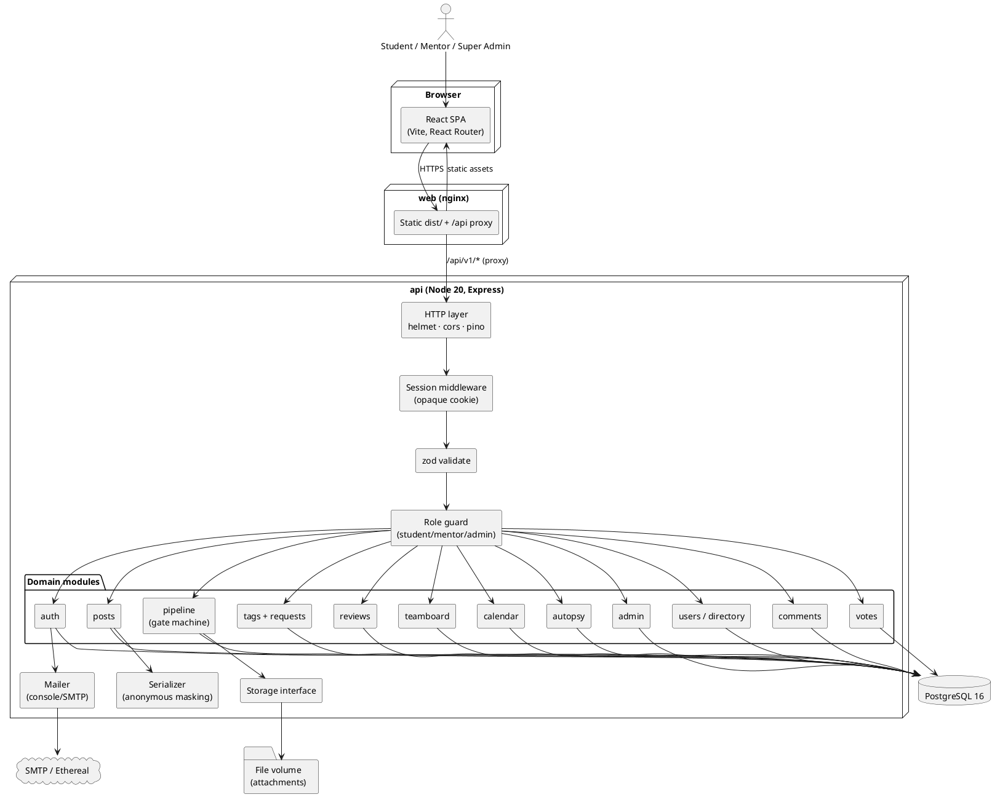
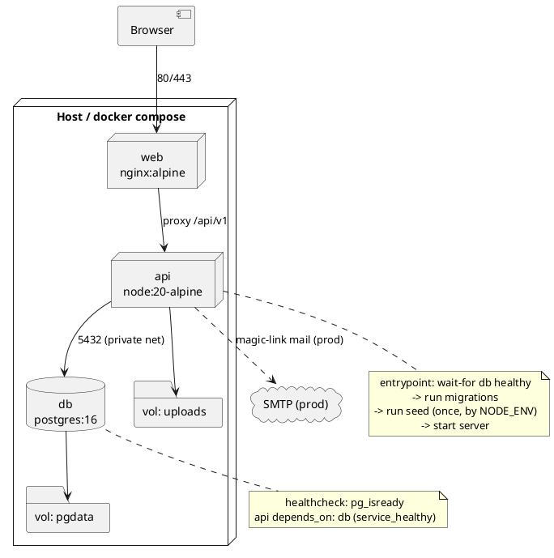
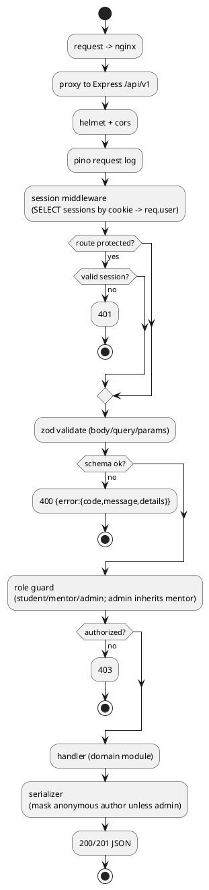

G
# IFN Backend — Architecture

The **ICFAI Founders Network** backend is a **modular monolith** on the PERN stack
(PostgreSQL · Express · React · Node). One Express process, split internally by domain
module, fronted by nginx and backed by Postgres + a file-storage volume + an outbound mailer
(magic-link only). It replaces the current localStorage mock data layer; the React SPA does a
hard cut to `/api/v1`.

See [[IFN Backend Index]] · [[IFN Backend — Data Model]] · [[IFN Backend — Sequence Flows]] · [[IFN Backend — Decisions (ADR)]].

## Component view (C4 container/component)

## Deployment view (Docker)

`docker-compose.dev.yml` overrides `api` (bind mount + `nodemon`) and `web` (`vite dev`) for hot reload.

## Module responsibilities

| Module | Owns | Key endpoints (under `/api/v1`) |
|---|---|---|
| `auth` | register, magic-link issue/verify, login, logout, `me` | `POST /auth/register`, `GET /auth/verify`, `POST /auth/login`, `POST /auth/logout`, `GET /auth/me` |
| `users` / directory | profiles, directory filter, admin role changes | `GET /users`, `GET /users/:id`, `PATCH /me`, `PATCH /users/:id/role` |
| `posts` | feed + problem-hub posts, badges, pin, edit-with-history | `GET/POST /posts`, `PATCH/DELETE /posts/:id`, `POST /posts/:id/pin` |
| `comments` | public comment threads | `GET/POST /posts/:id/comments`, `DELETE …/:cid` |
| `votes` | per-user up/down | `PUT /posts/:id/vote` |
| `tags` | tags, new-tag + `#Success` approval queue | `GET /tags`, `POST /tag-requests`, `POST /tag-requests/:id/approve|reject`, `POST /posts/:id/success-request` |
| `pipeline` | ideas, IFN-n, gate machine, lock, reject/refine, **dossier**, per-stage deliverables, extra asks, attachments | `POST /ideas`, `GET /ideas/:id/dossier`, `POST /ideas/:id/stages/:gate/submit`, `POST /ideas/:id/assign`, `/pickup`, `/gate`, `/reject`, `/refine`, `/resubmit`, `POST /ideas/:id/extra-asks`, `POST /pipeline/lock` |
| `reviews` | per-stage mentor rubric + feasibility + feedback (review history) | `POST /ideas/:id/stages/:gate/review`, `GET /ideas/:id/reviews` |
| `teamboard` | talent posts + applications | `GET/POST /team-posts`, `POST /team-posts/:id/apply` |
| `calendar` | events, per-user hide, event requests | `GET/POST /events`, `DELETE /events/:id/me`, `POST /event-requests`, `…/approve` |
| `autopsy` | idea autopsy reports | `POST /posts/:id/autopsy` |
| `admin` | queue views, pin, pipeline lock, overrides | `GET /admin/queue`, … |

## Request lifecycle

## Cross-cutting rules baked into the layers

- **Anonymous masking** lives in the serializer, never the client: `author_id` is always stored;
  the response strips author identity for `anonymous` posts unless the requester is `admin`.
- **Roles are server-owned.** The old client-side role switcher is gone; only an admin can change a
  role via `PATCH /users/:id/role`.
- **Gate transitions** are validated by a single state machine (see [[IFN Backend — Sequence Flows]])
  and every change is audited.
- **Errors** use one envelope: `{ "error": { "code", "message", "details" } }`.

Related: [[IFN Backend — Data Model]] · [[IFN Backend — Decisions (ADR)]] · [[IFN PRD]]
