# IFN Backend — Data Model

PostgreSQL schema for the IFN backend. **Hybrid** modeling (see [[IFN Backend — Decisions (ADR)]]):
a `posts` table for the common shape + `kind`; a 1:1 `ideas_pipeline` extension; child tables for
anything that is a list, per-user, or audited; and JSONB columns for fixed-shape forms that are
read whole and never queried piecewise (`basic_details`, `feasibility`, `mentor_criteria`,
`autopsy`, `original`). Field names derive from `~/lumenor/ifn/src/data/seed.js`.

See [[IFN Backend Index]] · [[IFN Backend — Architecture]] · [[IFN Backend — Sequence Flows]].

## ER diagram

```plantuml
@startuml
hide circle
skinparam linetype ortho
skinparam shadowing false

entity users {
  * id : uuid <<PK>>
  --
  name : text
  email : citext <<unique>>
  role : text  // student|mentor|admin
  region : text
  sector : text
  domain : text
  startup : text
  bio : text
  phone : text
  linkedin : text
  incubation_interest : bool
  avatar_tick : int
  verified : bool
  created_at : timestamptz
}

entity user_settings {
  * user_id : uuid <<PK,FK>>
  --
  email_events : bool
  email_gate : bool
  inapp_votes : bool
  inapp_mentions : bool
  theme : text
}

entity sessions {
  * id : text <<PK>>  // opaque
  --
  user_id : uuid <<FK>>
  user_agent : text
  expires_at : timestamptz
  created_at : timestamptz
}

entity magic_tokens {
  * id : uuid <<PK>>
  --
  email : citext
  user_id : uuid <<FK,null>>
  token_hash : text
  purpose : text  // verify|login
  expires_at : timestamptz
  consumed_at : timestamptz <<null>>
  created_at : timestamptz
}

entity posts {
  * id : uuid <<PK>>
  --
  author_id : uuid <<FK>>
  kind : text  // idea|problem
  anonymous : bool
  startup : text
  title : text
  problem : text
  solution : text
  target_users : text
  solution_hypothesis : text
  market_size : text
  team : text
  tests_done : text
  status : text  // draft|published
  pinned : bool
  badges : text[]  // IdeaAutopsy|IdeaValidation|Success
  success_request : text  // none|pending|approved|rejected
  basic_details : jsonb
  feasibility : jsonb
  mentor_criteria : jsonb
  autopsy : jsonb
  original : jsonb  // pre-edit snapshot
  edited : bool
  edited_at : timestamptz <<null>>
  created_at : timestamptz
}

entity ideas_pipeline {
  * post_id : uuid <<PK,FK>>
  --
  ifn : int <<unique>>
  gate : int  // 1..6
  gate_status : text
  pipeline_state : text  // active|rejected|refine
  mentor_id : uuid <<FK,null>>
  mentor_feedback : text
}

entity pipeline_settings {
  * id : int <<PK>>  // singleton row = 1
  --
  locked : bool
  ifn_counter : int
}

entity tags {
  * id : uuid <<PK>>
  --
  name : citext <<unique>>
  approved : bool
  created_at : timestamptz
}

entity post_tags {
  * post_id : uuid <<PK,FK>>
  * tag_id : uuid <<PK,FK>>
}

entity tag_requests {
  * id : uuid <<PK>>
  --
  tag : citext
  post_id : uuid <<FK,null>>
  author_id : uuid <<FK>>
  status : text  // pending|approved|rejected
  created_at : timestamptz
}

entity comments {
  * id : uuid <<PK>>
  --
  post_id : uuid <<FK>>
  author_id : uuid <<FK>>
  body : text
  created_at : timestamptz
}

entity post_votes {
  * post_id : uuid <<PK,FK>>
  * user_id : uuid <<PK,FK>>
  --
  value : int  // -1 | 1
}

entity sub_threads {
  * id : uuid <<PK>>
  --
  post_id : uuid <<FK>>
  author_id : uuid <<FK>>
  body : text
  created_at : timestamptz
}

entity gate_transitions {
  * id : uuid <<PK>>
  --
  post_id : uuid <<FK>>
  from_gate : int <<null>>
  to_gate : int <<null>>
  from_state : text
  to_state : text
  changed_by : uuid <<FK>>
  role : text
  reason : text
  created_at : timestamptz
}

entity attachments {
  * id : uuid <<PK>>
  --
  post_id : uuid <<FK>>
  submission_id : uuid <<FK,null>>
  gate : int <<null>>
  slot_key : text <<null>>
  original_name : text
  stored_path : text
  mime : text
  size : int
  uploaded_by : uuid <<FK>>
  created_at : timestamptz
}

entity idea_submissions {
  * id : uuid <<PK>>
  --
  post_id : uuid <<FK>>
  gate : int  // 1..6
  payload : jsonb  // template field values
  status : text  // draft|submitted|revision_requested|approved
  submitted_at : timestamptz <<null>>
  created_at : timestamptz
}

entity idea_reviews {
  * id : uuid <<PK>>
  --
  post_id : uuid <<FK>>
  gate : int
  reviewer_id : uuid <<FK>>
  criteria : jsonb  // 7-criteria rubric
  feasibility : jsonb  // mentor confirmed/override
  feedback : text
  decision : text  // approved|revision
  created_at : timestamptz
}

entity idea_extra_asks {
  * id : uuid <<PK>>
  --
  post_id : uuid <<FK>>
  gate : int <<null>>
  label : text
  status : text  // open|done
  created_by : uuid <<FK>>
  created_at : timestamptz
}

entity events {
  * id : uuid <<PK>>
  --
  creator_id : uuid <<FK>>
  audience : text  // all|self
  type : text  // Workshop|Mentorship|Deadline|Hackathon|Other
  title : text
  description : text
  start_at : timestamptz
  end_at : timestamptz
  all_day : bool
  created_at : timestamptz
}

entity event_hidden {
  * user_id : uuid <<PK,FK>>
  * event_id : uuid <<PK,FK>>
}

entity event_requests {
  * id : uuid <<PK>>
  --
  requester_id : uuid <<FK>>
  title : text
  desired_date : timestamptz
  note : text
  status : text  // pending|approved|rejected
  resolved_event_id : uuid <<FK,null>>
  created_at : timestamptz
}

entity team_posts {
  * id : uuid <<PK>>
  --
  author_id : uuid <<FK>>
  title : text
  startup : text
  description : text
  looking_for : text
  skills : text[]
  commitment : text
  stage : text
  created_at : timestamptz
}

entity team_applications {
  * id : uuid <<PK>>
  --
  team_post_id : uuid <<FK>>
  applicant_id : uuid <<FK>>
  message : text
  status : text  // sent|accepted|rejected
  created_at : timestamptz
}

users ||--o| user_settings
users ||--o{ sessions
users ||--o{ magic_tokens
users ||--o{ posts
posts ||--o| ideas_pipeline
users ||--o{ ideas_pipeline : mentor_id
posts ||--o{ post_tags
tags ||--o{ post_tags
users ||--o{ tag_requests
posts ||--o{ tag_requests
posts ||--o{ comments
users ||--o{ comments
posts ||--o{ post_votes
users ||--o{ post_votes
posts ||--o{ sub_threads
users ||--o{ sub_threads
posts ||--o{ gate_transitions
users ||--o{ gate_transitions : changed_by
posts ||--o{ attachments
users ||--o{ attachments : uploaded_by
posts ||--o{ idea_submissions
idea_submissions ||--o{ attachments : submission_id
posts ||--o{ idea_reviews
users ||--o{ idea_reviews : reviewer_id
posts ||--o{ idea_extra_asks
users ||--o{ idea_extra_asks : created_by
users ||--o{ events
users ||--o{ event_hidden
events ||--o{ event_hidden
users ||--o{ event_requests
events |o--o| event_requests : resolved_event_id
users ||--o{ team_posts
team_posts ||--o{ team_applications
users ||--o{ team_applications : applicant_id
@enduml
```

## Table notes

### Identity & auth
- **users** — one row per real account (the demo's single `'me'` user is generalized; every
  `seed.js` member becomes a real account). `role ∈ {student, mentor, admin}`; admin inherits
  mentor powers. `email` is `citext` + unique, must end `@ifheindia.org` (checked in app, not a DB
  constraint, to keep the rule swappable).
- **user_settings** — the PRD notification toggles (UI-only) + theme. 1:1 with users.
- **sessions** — opaque session id stored in the httpOnly cookie; row deleted on logout/ban.
- **magic_tokens** — one-time hashed tokens for register-verify and passwordless login; `consumed_at`
  enforces single use; `expires_at` bounds validity.

### Content
- **posts** — unifies `idea` and `problem` (`kind`). `problem` rows keep `solution` empty.
  Announcements are admin-authored `idea` posts with `pinned=true`. Drafts are `status='draft'`.
  `badges` is the small fixed set; `success_request` tracks the `#Success` lifecycle. The four
  JSONB columns hold fixed-shape forms; `original` snapshots pre-edit title/problem/solution for the
  "Main Thread vs edited" display.
- **ideas_pipeline** — 1:1 extension present only for `idea` posts that entered the pipeline. `ifn`
  is the sequential **IFN-n** (unique, reused on refine&retry). `gate 1..6`, `pipeline_state ∈
  {active, rejected, refine}`.
- **pipeline_settings** — singleton: global `locked` flag + the `ifn_counter` sequence source
  (allocated atomically).
- **tags / post_tags** — approved tags are trending-eligible; `post_tags` is the m2m.
- **tag_requests** — new-tag proposals **and** `#Success` requests routed to the admin queue.

### Threads, votes, steps, audit, files
- **comments** — public threads on Feed / Problem Hub posts.
- **post_votes** — per-user `-1|1`; composite PK gives one vote per user per post; score = sum.
- **sub_threads** — progress updates under the main thread (the per-idea private conversation was
  **removed** — see [[IFN Backend — Decisions (ADR)]]).
- *(actionable_steps removed)* — superseded by `idea_extra_asks` in the dossier model below.
- **gate_transitions** — append-only audit of every gate move (who, role, reason, when).
- **attachments** — metadata for the idea doc/PDF; bytes live on the file volume (`stored_path`).

### Idea dossier — per-stage deliverables (the rework)
The pipeline is no longer a thin description: each idea is an accumulating **dossier** visible only
to the **author, the assigned mentor, and admin**. Served by `GET /api/v1/ideas/:id/dossier`.
- **idea_submissions** — one row per gate the student works on. `payload` holds the gate's
  deliverable-template field values (the hybrid template — see [[IFN Backend — Decisions (ADR)]]
  ADR-017); files for that stage are `attachments` rows pointing back via `submission_id` + `slot_key`.
  `status` tracks draft → submitted → revision_requested → approved. Submissions accumulate so the
  mentor sees the full G1→G6 history, not just the latest.
- **idea_reviews** — review *history*, one row per mentor evaluation of a stage: the 7-criteria
  `criteria` rubric + `feasibility` (mentor confirm/override of the student's self-assessment) +
  `feedback` + `decision` (approved → advance, or revision → back to the student). This replaces the
  single `mentor_feedback` / `mentor_criteria` that previously overwrote in place; `ideas_pipeline`
  keeps only the *latest* feedback as a convenience denormalization.
- **idea_extra_asks** — generalizes the old `actionable_steps`: custom per-idea/per-gate deliverable
  requests the assigned mentor or admin add, which appear in the student's stage checklist.
- **attachments** gains `submission_id`, `gate`, `slot_key` so every file is traceable to the exact
  stage + deliverable slot it satisfies.

### Calendar & team
- **events** — `audience='all'` is visible to every student; `'self'` to the creator only.
- **event_hidden** — per-user removal (replaces the demo's single `removedEventIds`).
- **event_requests** — founder → admin queue; on approve the admin creates an event and links
  `resolved_event_id`.
- **team_posts / team_applications** — Talent Acquisition; applications are now real rows so the
  poster sees who applied.

## Indexes (initial)
- `posts(kind, status, created_at desc)`, `posts(pinned)` partial where pinned.
- `ideas_pipeline(gate, pipeline_state)`, `ideas_pipeline(mentor_id)`, unique `ideas_pipeline(ifn)`.
- `comments(post_id)`, `post_votes(post_id)`, `sub_threads(post_id)`, `gate_transitions(post_id)`.
- `idea_submissions(post_id, gate)`, `idea_reviews(post_id, gate)`, `idea_extra_asks(post_id, gate)`, `attachments(submission_id)`.
- `sessions(user_id)`, `magic_tokens(email)`, unique `tags(name)`, `team_applications(team_post_id)`.

Related: [[IFN Backend — Architecture]] · [[IFN Backend — Sequence Flows]] · [[IFN PRD]]
