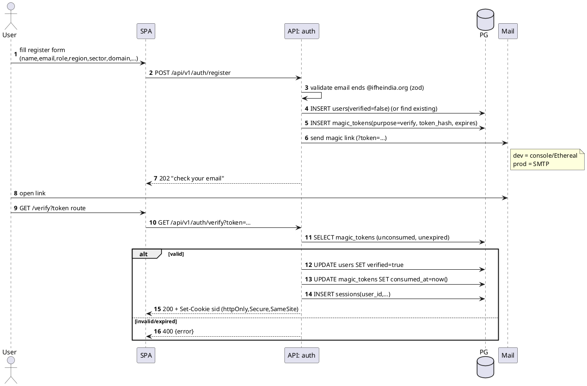
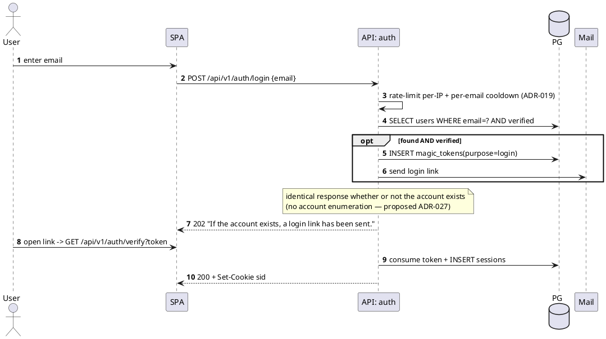
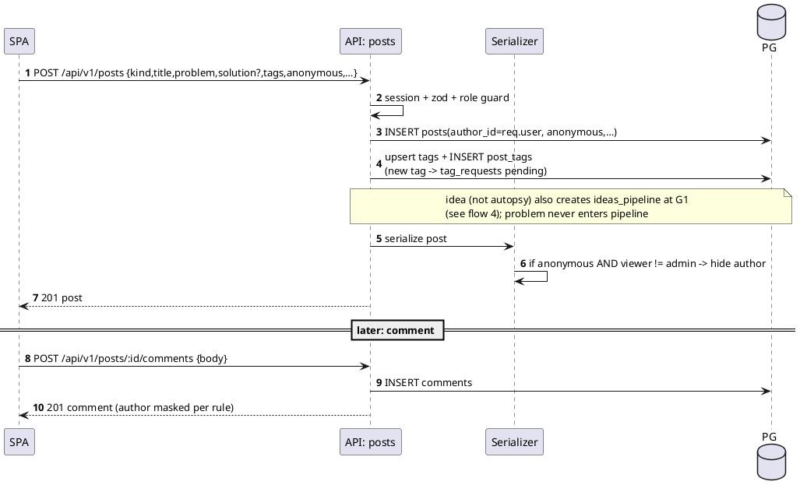
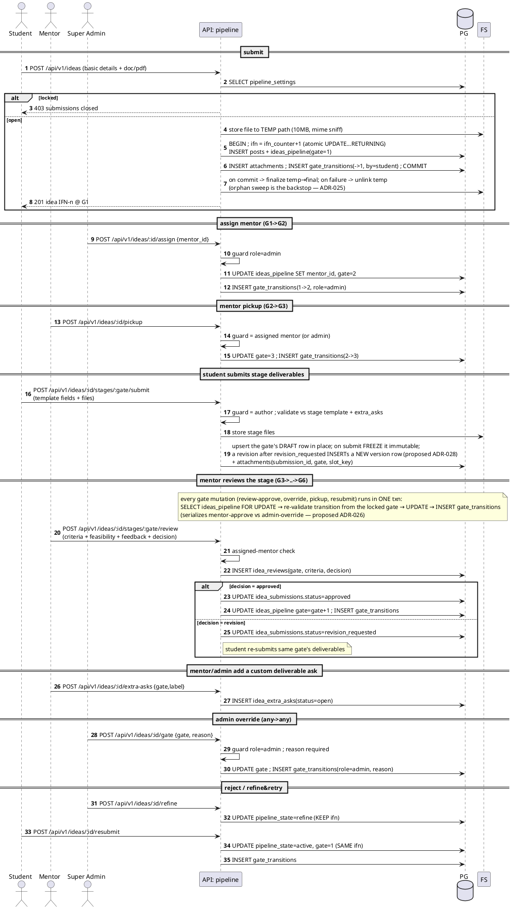
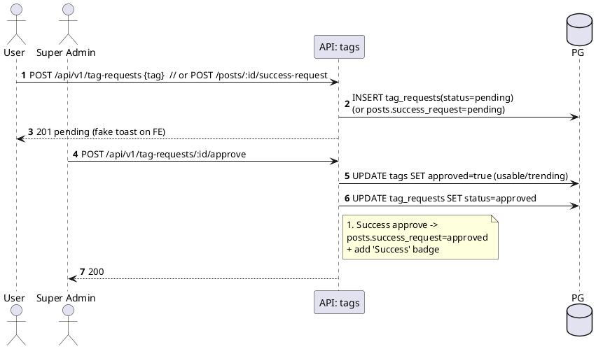
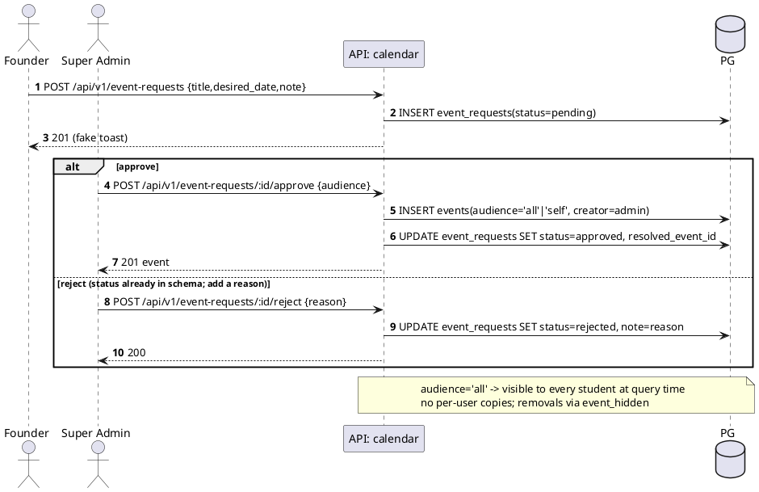
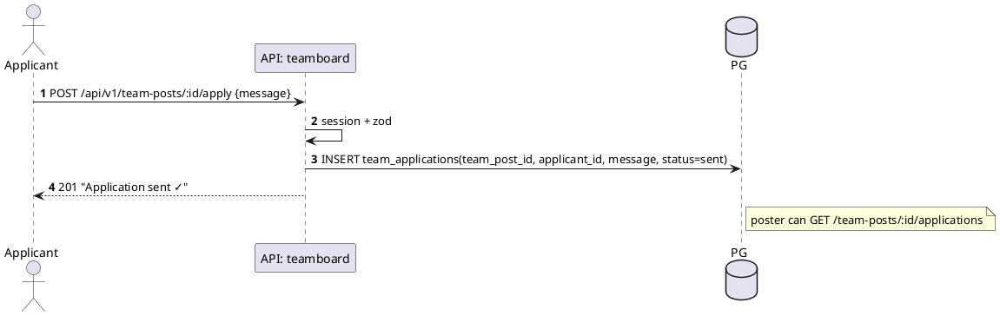
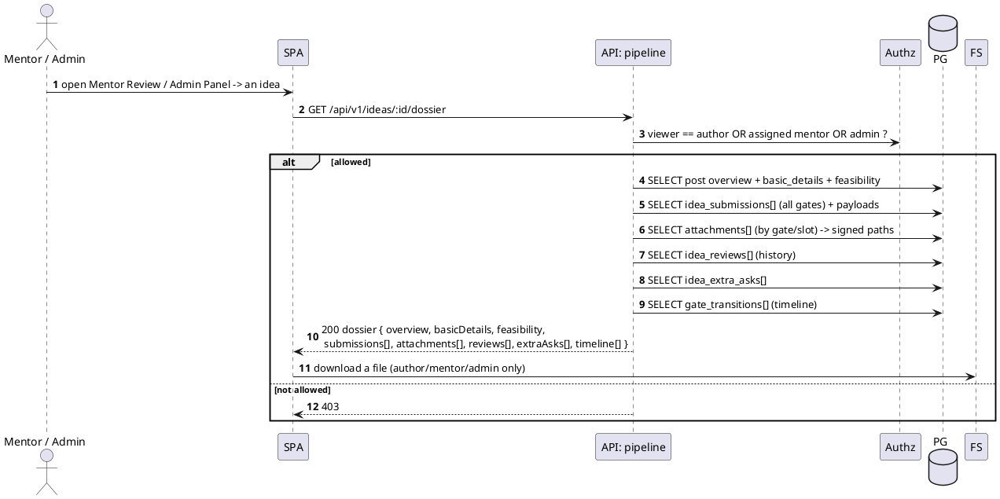

# IFN Backend — Sequence Flows

PlantUML sequence diagrams for the critical IFN backend flows. Participants: **SPA** (React),
**API** (the relevant Express module), **PG** (Postgres), **Mail** (mailer), **FS** (file storage).

See [[IFN Backend Index]] · [[IFN Backend — Architecture]] · [[IFN Backend — Data Model]].

## 1. Register → verify → session (magic-link)

## 2. Passwordless login

## 3. Create post (+ anonymous masking) and comment

## 4. Pipeline — submit → assign → pickup → **per-stage deliverables** → review → advance → override

Each gate has a deliverable template; the student submits that stage's deliverables (`idea_submissions`
+ files), the assigned mentor reviews them (`idea_reviews`), and approval advances the gate. Admin can
override any gate. See the dossier fetch in flow 8 and [[IFN Backend — Data Model]].

## 5. New-tag / #Success request → admin approval

## 6. Calendar event request → approve → add to all students

## 7. Talent Acquisition — apply

## 8. Idea dossier fetch (mentor / admin see the *full* case file)

> Replaces the old behaviour where Mentor Review / Admin Panel showed only a title + description.
> The dossier is the complete record; the public Feed still shows only the post overview.

# Sequence Flow Review — 2026-06-09

Review of 12 proposed flow fixes. Accepted-now items are already applied to the diagrams above;
the rest are deferred/rejected with reasons. Items 2/7/10/12 were decided in the ADR Design Review
and are cross-referenced, not re-litigated. Three new ADRs are *proposed* here (026 concurrency,
027 auth-response, 028 submission versioning) — see "Proposed ADRs" at the end.

## Verdict summary

| # | Fix | Verdict | When | Note |
|---|-----|---------|------|------|
| 1 | Prevent account enumeration | **Accept** | now | Flow 2 revised: identical 202 for all logins → proposed ADR-027 |
| 2 | Rate-limit auth flows | **Accept** | now | = ADR-019; extended to `/verify` + per-email cooldown (flow 2 note) |
| 3 | Mentor must accept assignment | **Already present** | later (decline path) | "Pickup" *is* acceptance; add a decline/reassign action later |
| 4 | Concurrency on gate writes | **Accept** | now | Flow 4 note: `SELECT … FOR UPDATE` + re-validate → proposed ADR-026 |
| 5 | Idempotency rules | **Tiered** | now (via #4/#10) / later (keys) | State-transition dupes solved by #4+#10; Idempotency-Key for creates later |
| 6 | File upload failure strategy | **Accept** | now | Flow 4 revised: temp→commit→finalize, unlink on fail; sweep backstop (ADR-025) |
| 7 | Notification generation | **Accept** | now (in-app) | = ADR-020; flows are the inline write points |
| 8 | Dossier query explosion | **Mostly reject** | later (conditional) | Volumes are small; ensure batched (no N+1) now, summary endpoint only if it hurts |
| 9 | Submission versioning | **Accept** | now | Flow 4 revised: draft mutable, submitted immutable, revision = new version → ADR-028 |
| 10 | Duplicate team applications | **Accept** | now | = ADR-021 (`UNIQUE` + 409); flow 7 |
| 11 | Event request extra states | **Partial** | now (reject) / reject (rest) | `rejected` already in schema (flow 6 now shows it + reason); skip revision/clarification states |
| 12 | Mentor communication channel | **Keep removed** | later (conditional) | = ADR-008 hook; dossier review loop is the async channel; add dossier notes only if asked |

## Detail (problem → risk → cost → recommendation)

**1 — Account enumeration.** *Problem:* flow 2 returned 202 for verified accounts, 401 ("register
first") otherwise — and register reveals existing emails. *Risk:* anyone can probe which
`@ifheindia.org` people have accounts → targeted phishing/spam; confirmed live (the E2E run got
`POST /auth/login for mehta@ → 401`). *Cost:* low — return one generic 202 always; do the
mail-send inside an `opt` only when the account exists; mirror on register (generic message, or mail
an existing user a login link instead of "already registered"). Watch the timing side-channel (the
found-path does more work) — keep it roughly constant or let rate-limiting blunt it. *Recommend:*
**now.** Applied to flow 2.

**3 — Mentor acceptance.** *Problem:* proposal wants Assign → Pending → Accept → progress. *Reality:*
the flow already has Assign (G1→G2) **then** Pickup (G2→G3) — "pickup" **is** the mentor's
acceptance; G2 is the pending-acceptance state. *Risk if unchanged:* the only real gap is no
**decline/reassign** — an unavailable mentor leaves the idea stuck at G2 until an admin notices.
*Cost:* low (one decline endpoint → back to unassigned/G1 + a transition; admin "pending-pickup per
mentor" view for load balancing). *Recommend:* **keep the two-step; add decline + load view later**
if mentors report stuck assignments. Don't add a redundant "pending" state.

**4 — Concurrency on gate writes.** *Problem:* mentor-approve (`gate+1`) and admin-override
(`gate=X`) both mutate `ideas_pipeline.gate` with no coordination. *Risk:* lost update + a nonsensical
`gate_transitions` trail when they land together; rare but corrupts the state machine the whole
pipeline depends on. *Cost:* low–moderate — wrap every gate mutation in a txn that does
`SELECT … FOR UPDATE` on the pipeline row, re-validates the transition is still legal from the
*locked* current gate, then writes. Pessimistic locking fits (short txns, low contention).
*Recommend:* **now** (proposed ADR-026). Annotated on flow 4. This also makes gate steps atomic,
which feeds item 5.

**5 — Idempotency.** *Problem:* double-click/retry → duplicate reviews, double gate advance,
duplicate ideas/applications. *Risk:* over-advanced gates (one stage → +2), confusing duplicate
history, duplicate rows. *Cost:* mostly free if #4 + #10 land — the row-lock + transition re-check
makes a second gate/review request see the already-advanced state and no-op/409; the team-apply
`UNIQUE` (ADR-021) rejects dupes. The one gap is **create** endpoints (`POST /ideas`,
`/stages/:gate/submit`) where a double-click makes two rows — handle with a client-supplied
**Idempotency-Key** (short-lived server store) *later*, plus the cheap frontend submit-disable now.
*Recommend:* **now via #4/#10; Idempotency-Key later; reject** a full idempotency framework for MVP.

**6 — File upload failure.** *Problem:* file written then DB row inserted (or vice-versa) — not
atomic. *Risk:* orphaned files (disk waste, minor) or rows pointing at missing files (broken
download, worse); the original flow even inserted `attachments` *before* the parent post. *Cost:*
moderate-low — write to a temp path, do the DB txn (post → attachments) , finalize the file on
commit, `unlink` on failure; the ADR-025 sweep reconciles stragglers. Never insert a row before the
bytes are durable. *Recommend:* **now.** Flow 4 reordered + annotated.

**8 — Dossier query explosion.** *Problem:* the dossier loads submissions + attachments + reviews +
extra-asks + transitions for all gates. *Risk:* large/slow fetch — but realistically an idea has ≤6
gates with a handful of rows each (dozens, not thousands), and "full case file" is the *point* of
ADR-017. The "explosion" is overstated for incubator scale. *Cost:* pagination/lazy-load/summary
endpoints = moderate + frontend rework. *Recommend:* **now** = verify each child is one batched
`WHERE post_id=?` query (no per-gate N+1) and attachments return metadata + signed URL only (bytes
lazy — already so). **Later/conditional** = a `GET /ideas/:id/dossier/summary` (counts + latest per
gate) for list views and lazy section loading, *only if* a real dossier proves slow. **Reject**
paginating the dossier for MVP — premature.

**9 — Submission versioning.** *Problem:* flow said "INSERT/UPDATE idea_submissions" — ambiguous; an
in-place update of a *submitted* payload would erase what the mentor reviewed, contradicting ADR-017's
"submissions accumulate" promise. *Risk:* lost audit — feedback that references an overwritten
submission becomes meaningless. *Cost:* low — rule: one mutable **draft** row per (post, gate); on
**submit** freeze it immutable; a revision after `revision_requested` INSERTs a **new version** row
(order by `created_at`/a `version`). *Recommend:* **now** (proposed ADR-028). Flow 4 clarified.

**11 — Event request lifecycle.** *Problem:* flow showed only request → approve. *Reality:*
`event_requests.status` already allows `rejected`; the path was just undrawn. *Risk if unchanged:*
admin can't say "no" with a reason; richer states (revision/clarification) would need a back-and-forth
channel. *Cost:* reject path = trivial (now drawn, + a `note` reason). Revision/clarification states =
moderate (new statuses + a requester channel + UI) for a low-frequency, low-stakes action. *Recommend:*
**now** for reject + reason; **reject** the extra states for MVP — reject-with-reason + resubmit is
enough. Revisit only if admins hit friction.

## Proposed ADRs (for the Decisions doc)
- **ADR-026 — Gate-mutation concurrency:** all `ideas_pipeline` gate changes run in a txn with
  `SELECT … FOR UPDATE` + transition re-validation (pessimistic; optimistic `gate_version` later if
  client-visible conflicts are wanted).
- **ADR-027 — Uniform auth responses:** login/register always return the same generic 202; never
  reveal account existence/verification state; pair with ADR-019 rate limits + timing care.
- **ADR-028 — Submission versioning:** draft = mutable single row per (post, gate); submitted =
  immutable; post-revision resubmit = new version row (auditable history).

Want these three folded into `IFN Backend — Decisions (ADR).md` as full ADR-026/027/028?

---

Related: [[IFN Backend — Architecture]] · [[IFN Backend — Data Model]] · [[IFN Backend — Decisions (ADR)]]
