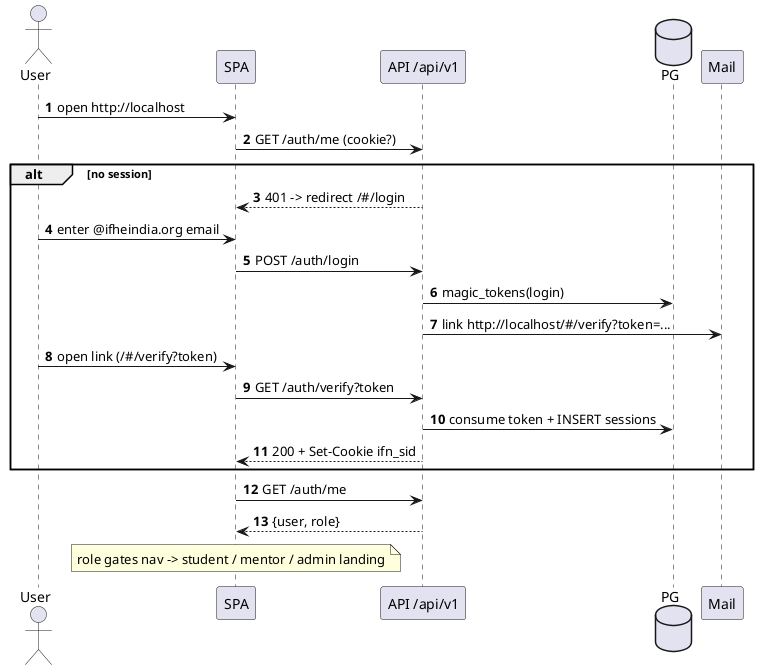
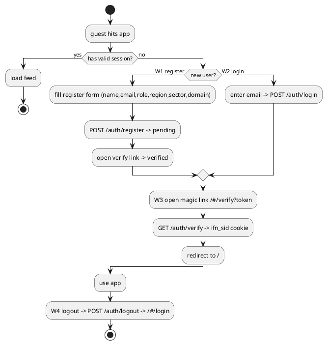
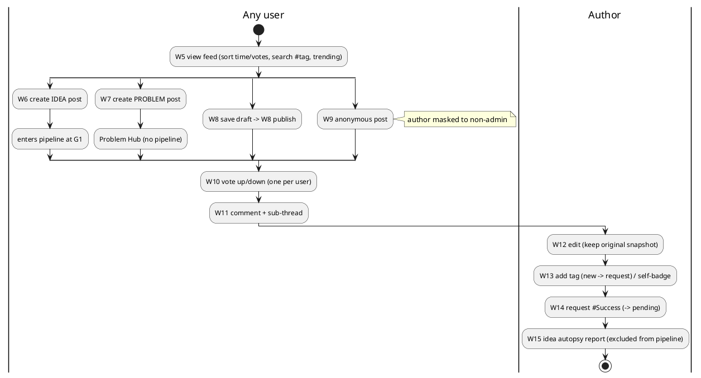
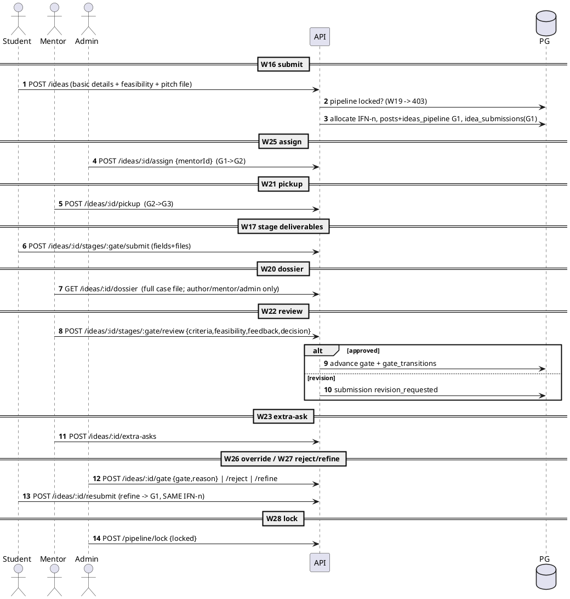
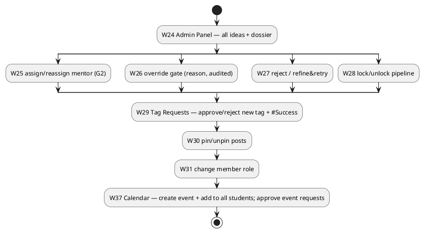
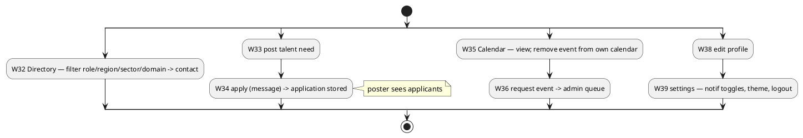

# IFN — Workflows

Every user-facing workflow in the IFN app, by role, with PlantUML. Each has a stable **W-id** that
the Playwright E2E suite maps to (`e2e/*.spec.js`). Roles: **Student**, **Mentor**, **Super Admin**
(admin inherits mentor powers). Auth is passwordless magic-link; the SPA uses HashRouter
(`/#/route`). See [[IFN Backend Index]] · [[IFN Backend — Sequence Flows]].

## Workflow catalog

| W | Workflow | Role | Entry | Expected outcome |
|---|---|---|---|---|
| W1 | Register new account | guest | `/#/register` | account pending → magic link → verified |
| W2 | Passwordless login | guest | `/#/login` | magic link → `/#/verify?token` → feed |
| W3 | Verify magic link | guest | `/#/verify?token` | `ifn_sid` cookie set → redirect `/` |
| W4 | Logout | any | header | session cleared → `/#/login` |
| W5 | View feed (sort/search/trending) | any | `/` | posts list, pinned first, `#tag` filter |
| W6 | Create idea post | any | Create Post | post created → enters pipeline G1 |
| W7 | Create problem post | any | Create Post → Problem Hub | problem in `/#/problems`, no pipeline |
| W8 | Save + publish draft | any | Create Post → draft | draft private → publish → feed |
| W9 | Anonymous post (masking) | any | Create Post → anon | author hidden to non-admin, shown to admin |
| W10 | Vote up/down | any | post card | score changes, one vote/user |
| W11 | Comment + sub-thread | any | post detail | comment + progress update appear |
| W12 | Edit post (original vs edited) | author | post menu | "edited" + original snapshot kept |
| W13 | Add tag / self-badge | author | post menu | new tag → tag request; IdeaAutopsy/Validation applied |
| W14 | Request #Success | author | post menu | success_request = pending |
| W15 | Idea Autopsy report | author | post menu | autopsy saved, excluded from pipeline |
| W16 | Submit idea to pipeline | student+ | Idea Pipeline → Submit | IFN-n issued, G1, dossier created |
| W17 | Submit stage deliverables | author | dossier → stage | idea_submission saved + files |
| W18 | View own pipeline + dossier | author | Idea Pipeline | gates G1–G6 + full dossier |
| W19 | Submit blocked when locked | student | Idea Pipeline (locked) | 403 / "submissions closed" banner |
| W20 | Mentor: view assigned dossier | mentor | Mentor Review | full case file, not a blurb |
| W21 | Mentor pickup (G2→G3) | mentor | Mentor Review | gate → G3 |
| W22 | Mentor stage review | mentor | Mentor Review | rubric+feasibility+feedback; approve advances / revision back |
| W23 | Mentor add extra-ask | mentor | dossier | extra_ask appears in student checklist |
| W24 | Admin: view all dossiers | admin | Admin Panel | every IFN + full dossier |
| W25 | Assign / reassign mentor (G2) | admin | Admin Panel | mentor set, gate → G2 |
| W26 | Override gate (audited) | admin | Admin Panel | any→any gate, reason logged |
| W27 | Reject / Refine & Retry | admin | Admin Panel | rejected, or refine → resubmit keeps IFN-n |
| W28 | Lock / unlock pipeline | admin | Admin Panel | submit gating toggles |
| W29 | Tag Requests approve/reject | admin | Tag Requests | new tag usable / #Success badge added |
| W30 | Pin / unpin post | admin | post menu | pinned to top of feed |
| W31 | Change member role | admin | (API/UI) | user role updated server-side |
| W32 | Directory browse/filter | any | Directory | filter role/region/sector/domain, contact |
| W33 | Post talent need | any | Talent Acquisition | team_post created |
| W34 | Apply to team post | any | Talent Acquisition | application stored, poster sees applicants |
| W35 | Calendar view + remove own | any | Calendar | events visible; remove from own calendar |
| W36 | Request event (founder→admin) | student/mentor | Calendar | event_request queued |
| W37 | Admin create event (+ all students) | admin | Calendar | event created, audience all |
| W38 | Edit profile | any | Profile | profile fields updated |
| W39 | Settings (notif/theme/logout) | any | Settings | toggles persist; logout |

## Master journey — login → role landing

## Auth workflows (W1–W4)

## Posts / Feed workflows (W5–W15)

## Idea pipeline + dossier (W16–W28) — the core flow

## Admin workflows (W24–W31, W37)

## Directory · Talent Acquisition · Calendar · Profile (W32–W39)

## Role × workflow access (quick matrix)

| Area | Student | Mentor | Super Admin |
|---|---|---|---|
| Auth, Feed, Posts, Vote, Comment, Directory, Team, Calendar view, Profile | ✓ | ✓ | ✓ |
| Submit idea + own dossier + stage deliverables | ✓ | ✓ | ✓ |
| Mentor Review (assigned dossiers, pickup, stage review, extra-ask) | | ✓ | ✓ |
| Admin Panel (all dossiers, assign, override, reject/refine, lock) | | | ✓ |
| Tag Requests, pin, role change, create event/add-to-all | | | ✓ |

Related: [[IFN Backend — Sequence Flows]] · [[IFN Backend — Architecture]] · [[IFN Backend — Data Model]]
